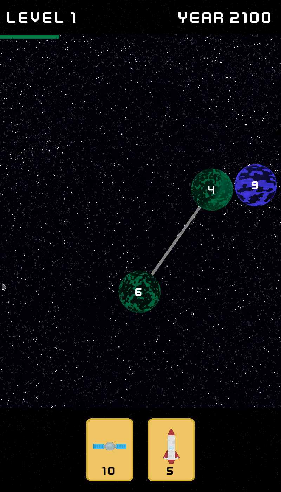
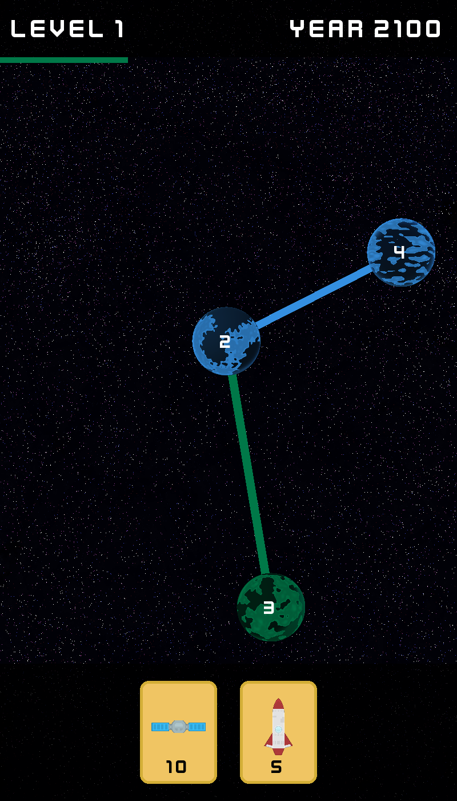

## Planet Conqueror - try this game [here](https://gitmanik.github.io/PlanetConqueror/)!

<p align=center>
<table>
<tr>
<td>

</td>
<td>

</td>
</tr></table>
</p>

**Planet Conqueror** is a Python game built using **Pygame**, inspired by the mobile game *Cell Expansion Wars*.  
The action takes place in outer space, where players conquer planets, launch satellites, and send units between worlds using upgradeable rockets.

The gameplay blends both **real-time** and **turn-based** mechanics, creating a unique and strategic experience.  
Levels are **procedurally generated**, ensuring a fresh challenge every time you play.

## How to play

- **Click on your planet** (green), then **click on an enemy or neutral (gray) planet** to create a connection and send units.
- **Drag a card** onto one of your planets to activate its effect.

Use quick thinking and tactical moves to outmaneuver your opponent and take over the galaxy!


## Used graphics
- [Kenney Planets](https://kenney.nl/assets/planets)
- [Kenney Space Shooter Extension](https://kenney.nl/assets/space-shooter-extension)
- [Kenney Future Narrow Font](https://kenney.nl/assets/kenney-fonts)
- [Kenney Playing Cards Pack](https://kenney.nl/assets/playing-cards-pack)

## Used libraries
- Pygame
- Pygbag

## Building and packaging via Pygbag
```bash
pip install -r requirements.txt
pygbag --ume_block 0 --build ExpansionWar/ 
```

## Building and running locally
``` bash
pip install -r requirements.txt
cd ExpansionWar
python3 main.py
```


## Tasks

### Engine
- [x] **Implement the game scene in QGraphicsScene** (1 point)
- [x] **Inheritance from QGraphicsItem – units as separate objects** (1 point)
- [x] **Interactivity of units – clickability, dragging, context menu** (3 points)
- [x] **Unit control – selection from the menu and movement on the game grid** (2 points)
- [x] **Loading unit graphics from .rc file** (1 point)
- [x] **Highlighting possible moves and attacks depending on the multiplier** (2 points)
- [x] **Combat system considering levels, unit multiplication, and special battle effects** (3 points)
- [x] **Turn mechanism and timer for making a move (turn clock)** (2 points)
- [ ] **Strategic suggestion system based on AI (e.g., best move of the turn)** (1 point)
- [ ] **Unit control via camera gestures (clicking with hand movement)** (2 points)
- [x] **Logger displaying messages on the console and in the QTextEdit interface with rotating logging** (1 point)
    * Press ` (backquote) to toggle
- [ ] **Switching between 2D and 3D view (including rendering units in 3D)** (4 points)

### Config
- [x] **Game mode: 1 player / 2 players local / network game (radio buttons group)** (0.5 points)
- [x] **IP address and port (line edit with mask, validation and hint)** (0.5 points)
- [ ] **Save and read game history (XML)** (1 point)
- [ ] **Save and read game history in NoSQL database (e.g. MongoDB or Firebase)** (1 point)
- [ ] **Save and read game history (JSON)** (1 point)
- [ ] **Read and playback saved game history with playback speed control** (1 point)
